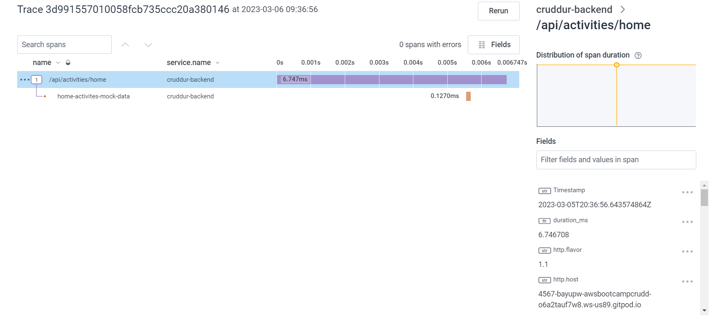

# Week 2 — Distributed Tracing

## HoneyComb

Make sure you have registered an account at honeycomb.io, create an new environment and take note of the API key.

Go to ```backend-flask``` directory and add the following files to the `requirements.txt` file

```
opentelemetry-api 
opentelemetry-sdk 
opentelemetry-exporter-otlp-proto-http 
opentelemetry-instrumentation-flask 
opentelemetry-instrumentation-requests
```

Install dependencies from the ```backend-flask``` directory

```sh
cd backend-flask
pip install -r requirements.txt
```

To initialize a tracer and Flask instrumentation to send data to Honeycomb, add the following code to the `app.py`. Reference: https://docs.honeycomb.io/getting-data-in/opentelemetry/python/#initialize

```py
from opentelemetry import trace
from opentelemetry.instrumentation.flask import FlaskInstrumentor
from opentelemetry.instrumentation.requests import RequestsInstrumentor
from opentelemetry.exporter.otlp.proto.http.trace_exporter import OTLPSpanExporter
from opentelemetry.sdk.trace import TracerProvider
from opentelemetry.sdk.trace.export import BatchSpanProcessor
```


```py
# Initialize tracing and an exporter that can send data to Honeycomb
provider = TracerProvider()
processor = BatchSpanProcessor(OTLPSpanExporter())
provider.add_span_processor(processor)
trace.set_tracer_provider(provider)
tracer = trace.get_tracer(__name__)

app = Flask(__name__)

# Initialize automatic instrumentation with Flask
FlaskInstrumentor().instrument_app(app)
RequestsInstrumentor().instrument()
```

Add the following Env Vars to `backend-flask:` under section `environment:` in `docker-compose.yml` file

```yml
        OTEL_EXPORTER_OTLP_ENDPOINT: "https://api.honeycomb.io"
        OTEL_EXPORTER_OTLP_HEADERS: "x-honeycomb-team=${HONEYCOMB_API_KEY}"
        OTEL_SERVICE_NAME: "${HONEYCOMB_SERVICE_NAME}"
```

Set Honeycomb API key in environment variables:

```sh
export HONEYCOMB_API_KEY="honeycombapikeyhere"
```

To set it in gitpod environment variables, use ```gp env```

```sh
gp env HONEYCOMB_API_KEY="honeycombapikeyhere"
```

Set service name using environment variables `HONEYCOMB_API_KEY` or set hardcode `OTEL_SERVICE_NAME` in `docker-compose.yml`

```sh
export HONEYCOMB_SERVICE_NAME="cruddur"
gp env HONEYCOMB_SERVICE_NAME="cruddur"
```

```sh
cd frontend-react-js
npm install
cd ..
docker compose -f "docker-compose.yml" up
```

To add a (hardcoded) span do the following:
1. Import tracer by following this doc: https://docs.honeycomb.io/getting-data-in/opentelemetry/python/#acquiring-a-tracer
2. Create spans by following doc: https://docs.honeycomb.io/getting-data-in/opentelemetry/python/#creating-spans

Test this on `home_activities.py` file and add the following code for the tracer:
```py
from opentelemetry import trace

tracer = trace.get_tracer("home.activities")
```

For adding span, put all the existing `def (run):` code under a new span
```py
from opentelemetry import trace

tracer = trace.get_tracer("home.activities")
```py
class HomeActivities:
  def run():
    with tracer.start_as_current_span("home-activites-mock-data"):
     # existing code
     span.set_attribute("app.result_length", len(results))
     return results
```

Sample working trace and spans on Honeycomb as per the following screenshot

